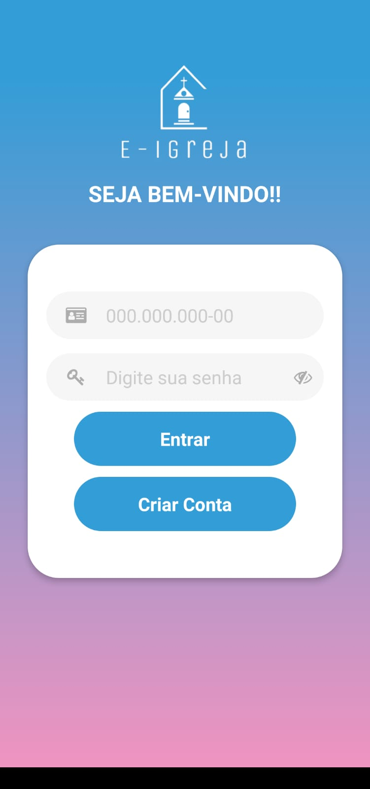
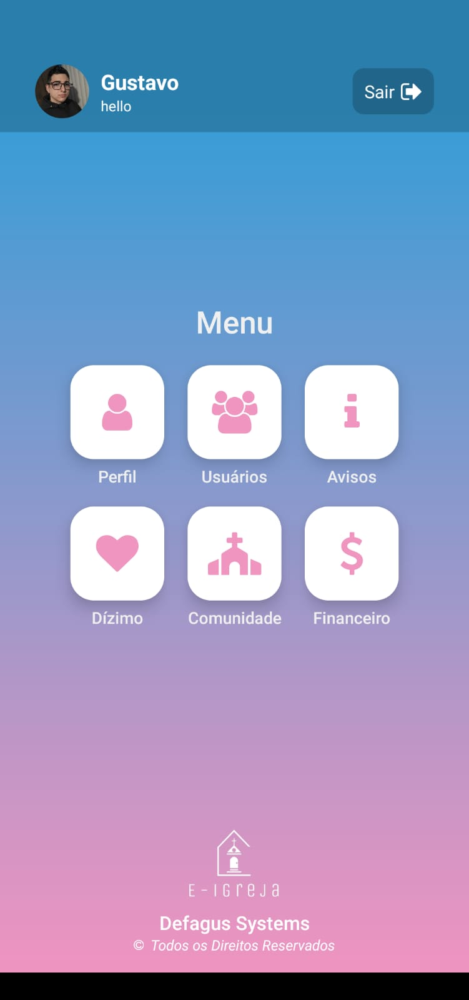
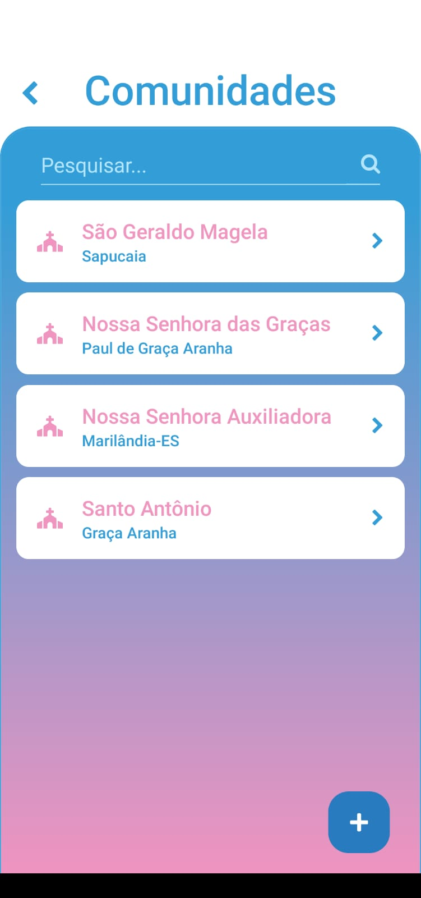

<div align="center">


# E-Igreja

**Aplicativo de gestão paroquial — reformulação mobile do [Sistema Igreja](https://github.com/gustavocaldonho/Sistema-igreja) (web).**


</div>

---

## 📖 Sobre o projeto

O **E-Igreja** aproxima a **Paróquia** de seus fiéis. Pelo aplicativo, os membros das comunidades acompanham avisos, consultam e pagam o dízimo e visualizam o perfil da sua comunidade; a administração gerencia usuários, comunidades, avisos e o controle financeiro — tudo na palma da mão.

Este repositório é a reformulação para **aplicativo mobile** do [Sistema-igreja](https://github.com/gustavocaldonho/Sistema-igreja) — sistema web desenvolvido como Trabalho de Conclusão de Curso do curso Técnico em Informática para Internet, IFES Campus Colatina.

## ✨ Funcionalidades

- 🔐 **Login e cadastro** — autenticação por CPF e senha, com sessão persistida (`AsyncStorage`) e contexto de autenticação
- 🏠 **Menu** — acesso rápido aos módulos conforme o perfil do usuário
- 👥 **Usuários** — listagem com busca, cadastro e gerenciamento dos fiéis
- 📢 **Avisos** — comunicados da paróquia com **notificações push** (Firebase Cloud Messaging + Expo Notifications)
- 🏘️ **Comunidades** — listagem com busca e perfil da comunidade (fiéis, pagantes, total de dízimo e membros do conselho)
- 💰 **Dízimo** — acompanhamento mês a mês, status de pagamento e modal de pagamento no app
- 📊 **Caixa mortuária / Financeiro** — controle de entradas, saídas e receita por mês
- 👤 **Perfil** — dados do usuário, alteração de cadastro e histórico anual de contribuições

## 📱 Telas do aplicativo

<div align="center">

| Login | Cadastro | Menu |
|:---:|:---:|:---:|
|  |  |  |

| Comunidades | Dízimo | Financeiro |
|:---:|:---:|:---:|
|  |  |  |

</div>

## 🠠️ Tecnologias

| Camada | Tecnologia |
|---|---|
| App | React Native 0.74.5 + Expo SDK 51 |
| Navegação | React Navigation (Native + Stack) |
| Autenticação e push | Firebase (`@react-native-firebase/auth`, `messaging`) e Expo Notifications |
| Comunicação com API | Axios |
| Sessão local | AsyncStorage |
| Interface | Linear Gradient, Blur, FontAwesome5, Select Dropdown, Mask Input, Toast Message |
| Builds | EAS (Expo Application Services) |
| Banco de dados | MySQL — modelagem em `dao/` |

## 🏗️ Estrutura do projeto

```
sistema-igreja-app/
├── my-app/                      # Aplicativo Expo / React Native
│   ├── src/
│   │   ├── components/
│   │   │   ├── screens/         # Telas: Initial (login/cadastro), Menu, Users, Avisos,
│   │   │   │                    #        Comunidades, Dizimo, CaixaMortuaria,
│   │   │   │                    #        PerfilUser, PerfilCommunity, PageBase
│   │   │   └── auxiliary/       # Componentes reutilizáveis: InputGroup, BoxSearch,
│   │   │                        # ButtonAdd, ButtonBack, ModalBase, AlertMsg,
│   │   │                        # ToastMessage, LoadingIndicator
│   │   ├── contexts/auth.js     # Contexto de autenticação (sessão do usuário)
│   │   ├── routes/MyStack.js    # Navegação em stack entre as telas
│   │   ├── services/            # Integração com a API:
│   │   │                        # api, user, community, warning, payment, notification
│   │   └── images/              # Imagens da interface
│   ├── assets/                  # Ícone, adaptive icon, splash e favicon
│   ├── App.js                   # Ponto de entrada
│   ├── app.json                 # Configuração do Expo (nome, ícones, permissões, EAS)
│   └── eas.json                 # Perfis de build
├── backend/                     # API do servidor (submódulo Git)
├── dao/                         # Modelagem MySQL Workbench (.mwb) e scripts SQL
└── prints/                      # Capturas de tela usadas nesta documentação
```

## 🚀 Como executar

### Pré-requisitos

- [Node.js](https://nodejs.org/) e [Expo CLI](https://docs.expo.dev/)
- Arquivo `google-services.json` do Firebase em `my-app/`
- API do backend em execução (submódulo `backend/`)

### Passos

1. Clone o repositório com o submódulo do backend:
   ```bash
   git clone --recurse-submodules https://github.com/gustavocaldonho/sistema-igreja-app.git
   ```
2. Instale as dependências do app:
   ```bash
   cd sistema-igreja-app/my-app
   npm install
   ```
3. O app usa **módulos nativos do Firebase**, portanto exige um *development build* (não roda no Expo Go):
   ```bash
   npx expo run:android
   # ou pelo EAS:
   eas build --profile development --platform android
   ```
4. Inicie o servidor de desenvolvimento:
   ```bash
   npx expo start --dev-client
   ```

## 🗄️ Banco de dados

A pasta `dao/` contém a modelagem do banco no MySQL Workbench (`bd-sistema-igreja-app.mwb`) e o script de inserção de dados (`inset_datas.sql`).

## 👥 Autores

| [<br>**Gustavo Caldonho**](https://github.com/gustavocaldonho) | [<br>**Gabriel**](https://github.com/Gabrielnasan) |
|:---:|:---:|
